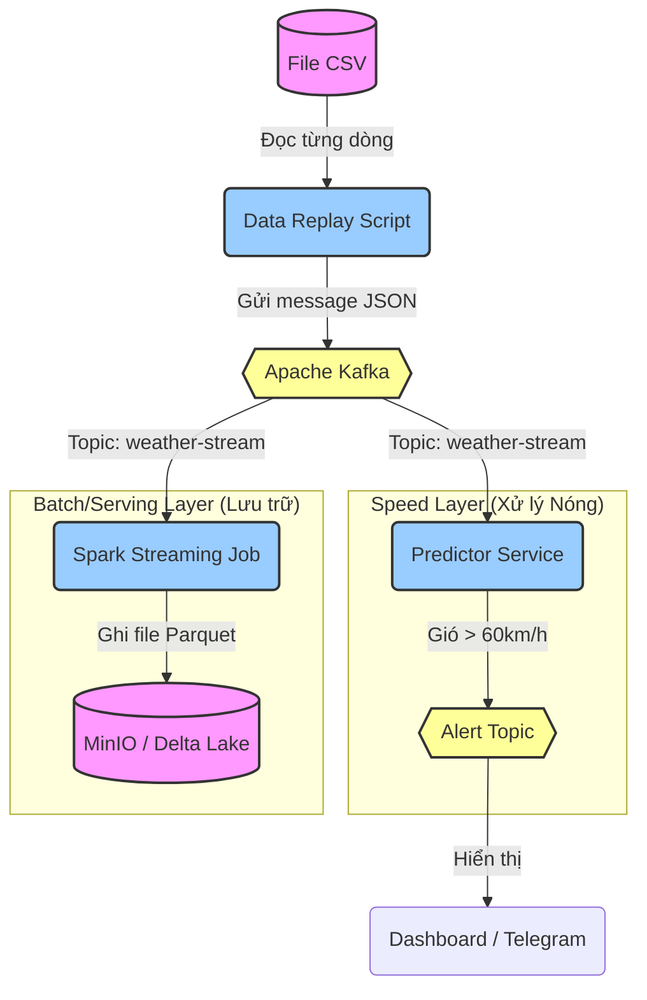

# 🌪️ Y.A.G.I Project: Giải Mã Luồng Dữ Liệu (End-to-End Workflow)

Tài liệu này giải thích chi tiết cách dữ liệu di chuyển trong hệ thống Yagi, từ lúc là một dòng tin trong file CSV cho đến khi trở thành cảnh báo bão trên màn hình.

---

## 🖼️ Sơ Đồ Tổng Quan (Architecture Diagram)

Hệ thống được thiết kế theo kiến trúc **Lambda Architecture** tối giản, xử lý dữ liệu theo thời gian thực (Real-time).

---

## 🚀 Chi Tiết Các Bước (Step-by-Step Flow)

### 1. Khởi Nguồn (Source)
*   **Vật liệu:** File `data/yagi_storm.csv`.
*   **Bản chất:** Đây là dữ liệu lịch sử của cơn bão Yagi đã xảy ra.
*   **Hành động:** Chúng ta không dùng nó như một file tĩnh, mà dùng để **tái hiện (replay)** lại cơn bão.

### 2. Mô Phỏng Cảm Biến (Simulation) - `jobs/yagi_producer.py`
*   **Vai trò:** Đóng vai các trạm khí tượng (IoT Sensors).
*   **Hoạt động:**
    1.  Script Python đọc từng dòng trong file CSV.
    2.  Chờ (sleep) một khoảng thời gian ngắn (0.1s - 1s) để giả lập thời gian thực.
    3.  Chuyển đổi dữ liệu thành định dạng JSON (ví dụ: `{"windspeed": 120, "pressure": 980...}`).
    4.  Bắn dữ liệu này vào **Kafka** (topic: `weather-stream`).

### 3. Vùng Đệm (The Buffer) - `Apache Kafka`
*   **Vai trò:** "Trái tim" luân chuyển máu (dữ liệu) đi khắp cơ thể.
*   **Vì sao cần nó?** Nếu Producer bắn quá nhanh mà các hệ thống xử lý (Spark/AI) chưa kịp chạy, dữ liệu sẽ nằm chờ ở đây, không bị mất.
*   **Trạng thái:** Lúc này dữ liệu đang "nóng" (hot data), chưa được lưu xuống ổ cứng vĩnh viễn.

### 4. Nhánh Lưu Trữ (Storage Path) - `jobs/spark_ingestion.py`
*   **Mục tiêu:** Lưu lại bằng chứng lịch sử.
*   **Hoạt động:**
    1.  **Spark Streaming** liên tục lắng nghe Kafka.
    2.  Ngay khi có gói tin mới, nó bắt lấy.
    3.  Nó chuyển đổi gói tin JSON đó thành định dạng bảng (DataFrame).
    4.  Ghi xuống **MinIO** dưới chuẩn **Delta Lake** (các file `.parquet` bạn thấy trong thư mục log).
*   **Kết quả:** Dữ liệu được lưu vĩnh viễn, an toàn, có thể truy vấn lại sau này (Time Travel).

### 5. Nhánh Trí Tuệ (Intelligence Path) - `predictor/predictor.py`
*   **Mục tiêu:** Phát hiện nguy hiểm ngay lập tức.
*   **Hoạt động:**
    1.  Service này chạy trong Docker, bên trong chứa một **AI Model** đã được huấn luyện (file `.pkl`).
    2.  Nó cũng lắng nghe Kafka (giống Spark).
    3.  Khi nhận dữ liệu:
        *   Nó hỏi Model: *"Gió 120km/h, áp suất 980mb thì có nguy hiểm không?"*
        *   Model trả lời: *"DANGEROUS" (Nguy hiểm).*
    4.  Nếu nguy hiểm, nó tạo một bản tin cảnh báo mới và bắn lại vào Kafka (topic `storm-alerts`).

### 6. Cảnh Báo & Hiển Thị (Action)
*   **Dashboard/Telegram:**
    *   Sẽ lắng nghe topic `storm-alerts`.
    *   Khi thấy tin nhắn mới, điện thoại bạn rung lên (Telegram) hoặc biểu đồ trên màn hình chuyển sang màu đỏ (Dashboard).

---

## 🎯 Tóm Tắt Vai Trò Các Công Nghệ

| Công nghệ | Tên gọi trong sơ đồ | Vai trò đời thường |
| :--- | :--- | :--- |
| **Python Script** | Producer | Người phát tin, đọc bản tin thời sự. |
| **Kafka** | Message Queue | Cái bưu điện trung chuyển thư từ cực nhanh. |
| **Spark** | Processor | Thư ký cần mẫn, chép lại mọi thứ vào sổ sách. |
| **MinIO + Delta** | Data Lake | Cái kho lưu trữ hồ sơ tuyệt mật, chống cháy nổ. |
| **Model AI** | Predictor | Chuyên gia phân tích rủi ro. |

Hy vọng tài liệu này giúp bạn hình dung rõ ràng đường đi của "những con số" trong dự án Yagi!
